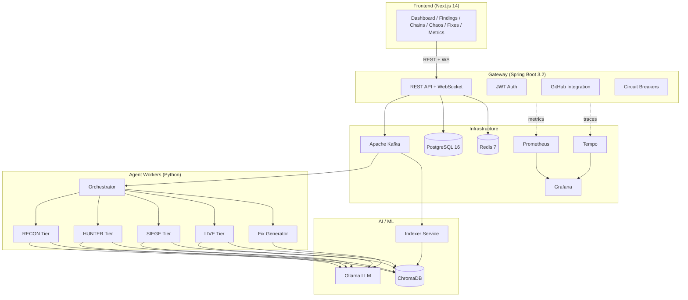

<div align="center">

# ChaosGuard AI

### Autonomous Security Scanner & Chaos Engineering Platform

**Drop in a GitHub URL. Get back a full security audit, attack chain analysis, chaos resilience report, and auto-generated fix PRs — powered entirely by local LLMs.**

[](LICENSE)
[](docker-compose.yml)
[](https://ollama.com)
[](gateway/)
[](frontend/)
[](helm/)
[](observability/)
[](observability/)
[](#api-documentation)

---

**No API keys. No cloud. No data leaves your machine.**

</div>

<br>

## What is ChaosGuard?

ChaosGuard is a **self-hosted, AI-powered security platform** that scans any GitHub repository across four escalating tiers of depth — from rapid static analysis to full chaos engineering simulations. Every finding comes with an auto-generated code fix, a unified diff, and one-click PR creation.

It runs entirely on your machine using **Ollama** for local LLM inference, **ChromaDB** for RAG-powered code understanding, and a **Kafka-driven agent architecture** that scales from a single laptop to a Kubernetes cluster.

<br>

## Architecture



**14 services**, one `docker compose up`. That's it.

<br>

## Key Features

<table>
<tr>
<td width="50%">

### Multi-Tier Scanning
Four escalating scan tiers with increasing depth:

- **RECON** — Static analysis in seconds. Secret detection, dependency vulnerabilities, config issues, dangerous function calls
- **HUNTER** — LLM-powered vulnerability hunting with RAG context. Finds injection flaws, auth bypasses, business logic bugs
- **SIEGE** — Attack chain construction, chaos cascade simulation, compound failure analysis, pentest playbook generation
- **LIVE** — DAST probes against running targets (SQLi, IDOR, auth bypass, race conditions)

</td>
<td width="50%">

### AI-Powered Fix Generation
Every finding gets an auto-generated fix:

- **Template fixes** for known patterns (secrets, configs, dependencies)
- **LLM-generated patches** with original/fixed code diffs
- **Sandbox validation** — fixes are compiled and tested before surfacing
- **One-click PR creation** — branches, commits, and labels auto-generated
- **Self-validation** — LLM reviews its own fixes for correctness

</td>
</tr>
<tr>
<td width="50%">

### Chaos Engineering
Resilience analysis that goes beyond vulnerabilities:

- Identifies missing circuit breakers, retry logic, timeouts, health checks
- Simulates **compound failure cascades** across service boundaries
- Estimates blast radius and recovery time for each scenario
- Generates **LitmusChaos experiment specs** ready for Kubernetes
- Maps failure propagation paths through your dependency graph

</td>
<td width="50%">

### RAG-Powered Code Understanding
Every agent reasons over your actual codebase:

- Full repo indexing with **nomic-embed-text** embeddings
- **ChromaDB** vector store for semantic code search
- Agents retrieve relevant code context before analysis
- Cross-file correlation catches vulnerabilities that span modules
- Dependency graph extraction for impact analysis

</td>
</tr>
</table>

<br>

## Quick Start

### Prerequisites

- **Docker Desktop** (4GB+ RAM allocated)
- **Ollama** installed ([ollama.com](https://ollama.com))
- **16GB+ RAM** recommended (24GB for concurrent SIEGE scans)

### 1. Clone & Configure

```bash
git clone https://github.com/Ayush1906saxena/ChaosGuard.git
cd ChaosGuard
cp .env.example .env
```

### 2. Pull LLM Models

```bash
ollama pull qwen2.5-coder:7b
ollama pull llama3.1:8b
ollama pull nomic-embed-text

# Start with memory-optimized settings
OLLAMA_MAX_LOADED_MODELS=3 OLLAMA_NUM_PARALLEL=1 OLLAMA_FLASH_ATTENTION=1 ollama serve
```

### 3. Launch

```bash
docker compose up -d
```

### 4. Open

| Service | URL |
|---------|-----|
| **Dashboard** | [http://localhost:3000](http://localhost:3000) |
| **API Gateway** | [http://localhost:8080](http://localhost:8080) |
| **Swagger UI** | [http://localhost:8080/swagger-ui.html](http://localhost:8080/swagger-ui.html) |
| **Grafana** | [http://localhost:3002](http://localhost:3002) (admin/admin) |
| **Prometheus** | [http://localhost:9090](http://localhost:9090) |

Paste a GitHub URL, select a scan tier, and hit **Launch Scan**.

<br>

## Scan Tiers

| Tier | Speed | What It Does | Agents |
|------|-------|-------------|--------|
| **RECON** | ~1 sec | Static analysis, secret detection, dependency audit, config review | Secret Scanner, Dependency Scanner, Config Auditor, SAST |
| **HUNTER** | ~8 min | LLM-powered vulnerability hunting with RAG code context | Vulnerability Hunter, Load Analyzer, Config Auditor, Chaos Architect |
| **SIEGE** | ~15 min | Attack chains, chaos simulation, compound failures, pentest playbooks | All Hunter agents + Attack Chain Constructor, Chaos Cascade Simulator, Exploit Analyst, Business Logic Analyzer |
| **LIVE** | Varies | Active DAST probes against a running target URL | SQLi Probe, IDOR Probe, Auth Bypass, Race Condition |

<br>

## Observability

ChaosGuard ships with a full observability stack:

- **Prometheus** scrapes metrics from the gateway and agent services every 15s
- **Grafana** comes pre-provisioned with two dashboards:
  - **ChaosGuard Overview** — API request rate, latency p50/p95/p99, error rates, JVM heap, active threads
  - **Chaos Experiments** — Resilience score timeline, fault injection events, recovery curves
- **Tempo** collects distributed traces via OpenTelemetry (OTLP)
- **Structured JSON logging** with traceId/spanId correlation for log-to-trace linking

Access Grafana at [http://localhost:3002](http://localhost:3002) with `admin/admin`.

<br>

## Kubernetes Deployment

ChaosGuard includes production-ready Helm charts:

```bash
# Render templates
helm template chaosguard helm/chaosguard/

# Install to a cluster
helm install chaosguard helm/chaosguard/ \
  --namespace chaosguard \
  --create-namespace \
  --set gateway.image.tag=latest \
  --set frontend.image.tag=latest
```

Features:
- **HorizontalPodAutoscaler** — Agent workers scale 2-8 replicas at 70% CPU
- **NetworkPolicy** — Inter-service traffic restrictions
- **Ingress** — NGINX ingress with TLS termination (`/` → frontend, `/api` → gateway)
- **Resource limits** — CPU/memory requests and limits on all pods
- **Health probes** — Liveness and readiness probes on all services

<br>

## API Documentation

Interactive Swagger UI is available at [http://localhost:8080/swagger-ui.html](http://localhost:8080/swagger-ui.html) with JWT Bearer authentication support.

### Key Endpoints

| Method | Endpoint | Description |
|--------|----------|-------------|
| `POST` | `/api/v1/scans` | Create a new scan |
| `GET` | `/api/v1/scans/{id}` | Get scan status |
| `GET` | `/api/v1/scans/{id}/findings` | List findings (paginated, filterable) |
| `GET` | `/api/v1/scans/{id}/fixes` | List generated fixes |
| `POST` | `/api/v1/scans/{id}/fixes/{fixId}/create-issue` | Create GitHub issue for a finding |
| `POST` | `/api/v1/scans/{id}/fixes/create-pr` | Create GitHub PRs for fixes |
| `GET` | `/api/v1/scans/{id}/attack-chains` | Get attack chains (SIEGE) |
| `GET` | `/api/v1/scans/{id}/chaos-scenarios` | Get chaos scenarios |
| `GET` | `/api/v1/scans/{id}/dependency-graph` | Dependency graph data |
| `POST` | `/api/v1/findings/{id}/feedback` | Submit finding feedback |

<br>

## Production Enhancements

| Feature | Technology | Description |
|---------|-----------|-------------|
| **Circuit Breakers** | Resilience4j | GitHub API, Kafka, agent calls protected with configurable failure thresholds |
| **Distributed Tracing** | OpenTelemetry + Tempo | End-to-end trace propagation across gateway, agents, and indexer |
| **Structured Logging** | Logback + Logstash Encoder | JSON logs with traceId/spanId correlation IDs |
| **Metrics** | Micrometer + Prometheus | JVM, HTTP, Kafka, and custom business metrics |
| **API Docs** | SpringDoc OpenAPI | Auto-generated Swagger UI with JWT auth |

<br>

## Tech Stack

| Layer | Technology |
|-------|-----------|
| **Frontend** | Next.js 14, React 18, Tailwind CSS, Framer Motion, Recharts, React Query, D3.js |
| **API Gateway** | Spring Boot 3.2, Spring Security (JWT), JPA/Hibernate, WebSocket (STOMP) |
| **Resilience** | Resilience4j circuit breakers, structured JSON logging |
| **Agents** | Python 3.12, FastAPI, asyncio, httpx |
| **LLM Inference** | Ollama (local), qwen2.5-coder:7b, llama3.1:8b |
| **Embeddings** | nomic-embed-text (768-dim) via Ollama |
| **Vector Store** | ChromaDB 0.5 |
| **Message Broker** | Apache Kafka (KRaft mode) |
| **Database** | PostgreSQL 16 + Flyway migrations |
| **Cache** | Redis 7 |
| **Observability** | Prometheus, Grafana, Tempo, OpenTelemetry |
| **Orchestration** | Docker Compose, Kubernetes (Helm) |

<br>

## Project Structure

```
ChaosGuard/
├── frontend/              # Next.js dashboard
├── gateway/               # Spring Boot API gateway
├── agents/                # Python AI agent workers
│   ├── tier1_recon/       #   Static analysis agents
│   ├── tier2_hunter/      #   LLM-powered vulnerability hunters
│   ├── tier3_siege/       #   Attack chain & chaos simulation
│   ├── dast/              #   Live DAST probe agents
│   └── generators/        #   Fix generation & sandbox validation
├── indexer/               # Repo cloning, parsing, embedding
├── mcp-server/            # MCP protocol server for AI assistants
├── observability/         # Prometheus, Grafana, Tempo configs
│   ├── prometheus/        #   Scrape configs
│   ├── grafana/           #   Provisioned dashboards
│   └── tempo/             #   Trace collection config
├── helm/                  # Kubernetes Helm charts
│   └── chaosguard/        #   Deployments, services, HPA, ingress
├── shared/                # Shared Python config & utilities
├── scripts/               # DB migrations, benchmarks
└── docker-compose.yml     # Full stack orchestration
```

<br>

## Configuration

All configuration is in `.env`. Key settings:

| Variable | Default | Description |
|----------|---------|-------------|
| `OLLAMA_CODE_MODEL` | `qwen2.5-coder:7b` | Model for code analysis and fix generation |
| `OLLAMA_REASONING_MODEL` | `llama3.1:8b` | Model for reasoning and attack chains |
| `OLLAMA_EMBED_MODEL` | `nomic-embed-text` | Embedding model for RAG (768-dim) |
| `MAX_CONCURRENT_SCANS` | `3` | Parallel scan limit |
| `GITHUB_TOKEN` | _(empty)_ | GitHub PAT for issue/PR creation |

### Memory Optimization

For machines with limited RAM, set these before starting Ollama:

```bash
export OLLAMA_MAX_LOADED_MODELS=3    # Max models in RAM simultaneously
export OLLAMA_NUM_PARALLEL=1         # Single concurrent request per model
export OLLAMA_FLASH_ATTENTION=1      # Flash attention for lower memory usage
```

With these settings, ChaosGuard runs comfortably on **16GB RAM**.

<br>

## MCP Server

ChaosGuard includes an **MCP (Model Context Protocol) server** that exposes scan data as tools for AI assistants like Claude:

```bash
# The MCP server starts automatically with docker compose
# Connect your AI assistant to http://localhost:5001
```

Available tools: `list_scans`, `get_scan`, `get_findings`, `get_attack_chains`, `get_chaos_scenarios`, `search_code`

<br>

## Contributing

Contributions are welcome! Please open an issue first to discuss what you'd like to change.

<br>

## License

MIT

<br>

---

<div align="center">

**If ChaosGuard helped you find a vulnerability, consider giving it a star.**

</div>
